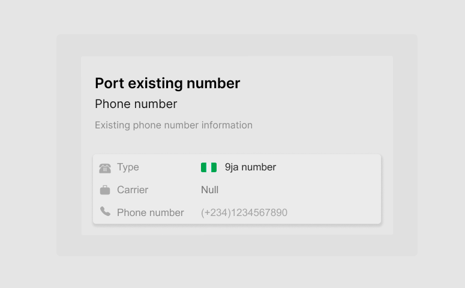

# network_provider_identifier

A program that detects the Carrier/Mobile Network Of A Nigerian Phone Number after the first four digits max

The UI screenshot is attached below

Figma link: https://www.figma.com/file/A9J1AJysluNjg1ZgWTxNAp/Free---Network-Carrier-UI?node-id=0%3A1
